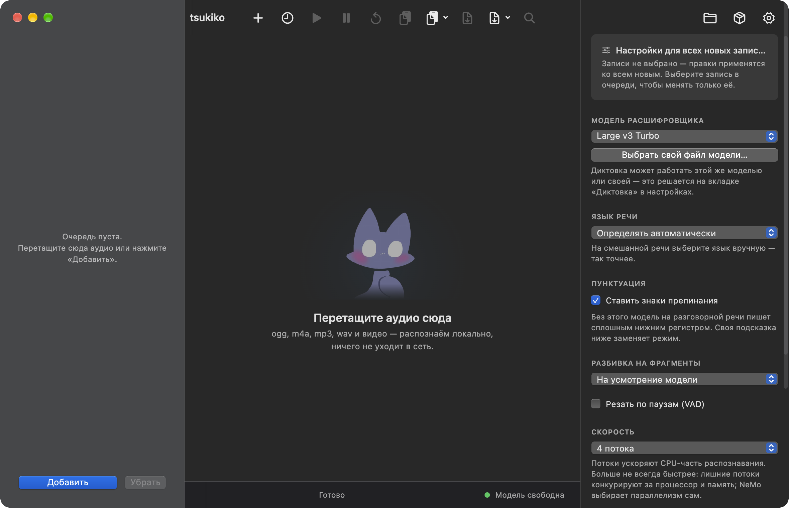
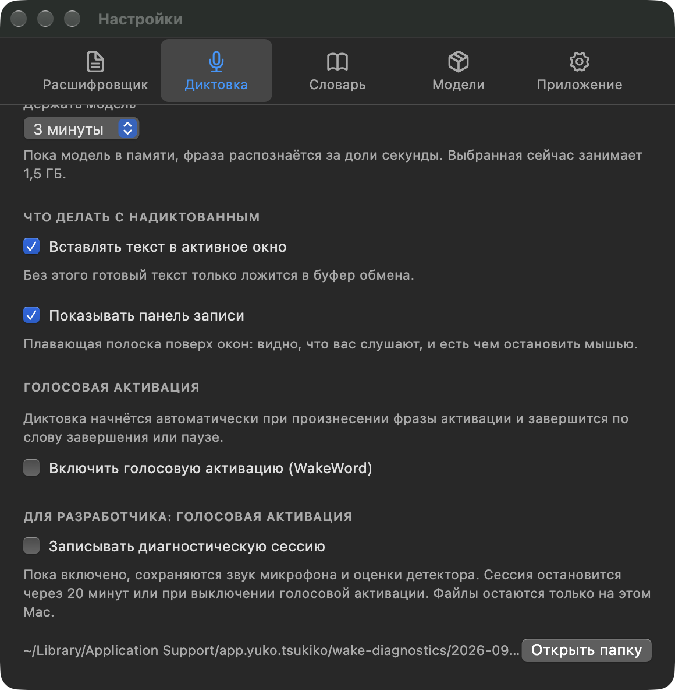

<div align="center">


# Tsukiko (月子)

**Приватная локальная расшифровка аудио, умная диктовка и голосовая активация для macOS и Windows.**  
*Ни единого байта звука или текста не покидает ваш компьютер. Полная автономность, нулевая задержка сети и абсолютная конфиденциальность.*

<p align="center">
  <b>Русский</b> •
  <a href="README.en.md">English</a>
</p>

<p align="center">
  <a href="https://github.com/Yukovsky/tsukiko/releases"></a>
  
  <a href="LICENSE"></a>
  
  
  
</p>

<br />



</div>

---

## Содержание

- [Почему Tsukiko](#почему-tsukiko)
- [Ключевые возможности](#ключевые-возможности)
- [Интерфейс приложения](#интерфейс-приложения)
- [Архитектура системы](#архитектура-системы)
- [Установка и быстрый старт](#установка-и-быстрый-старт)
  - [Готовые сборки](#готовые-сборки)
  - [Первый запуск на macOS](#первый-запуск-на-macos)
  - [Запуск на Windows](#запуск-на-windows)
- [Руководство по использованию](#руководство-по-использованию)
  - [1. Пакетная расшифровка файлов](#1-пакетная-расшифровка-файлов)
  - [2. Глобальная системная диктовка](#2-глобальная-системная-диктовка)
  - [3. Голосовая активация без рук](#3-голосовая-активация-без-рук)
  - [4. Персональный словарь и подсказки](#4-персональный-словарь-и-подсказки)
- [CLI и локальный API](#cli-и-локальный-api)
  - [Утилита командной строки](#утилита-командной-строки)
  - [Локальный защищённый API](#локальный-защищённый-api)
- [Интеграция с ИИ-агентами](#интеграция-с-ии-агентами)
- [Сборка из исходников](#сборка-из-исходников)
- [Тестирование и контроль качества](#тестирование-и-контроль-качества)
- [Документация](#документация)
- [Лицензия](#лицензия)

---

## Почему Tsukiko

Большинство современных инструментов диктовки и транскрипции либо зависят от облачных серверов (передавая ваши приватные аудиозаписи третьим лицам и требуя постоянной подписки), либо представляют собой сырые консольные утилиты без удобного настольного интерфейса, системной интеграции и адаптации под голос пользователя.

Tsukiko объединяет максимальную производительность нативных C/C++ движков с продуманным настольным приложением:

| Характеристика | Tsukiko | Облачные сервисы *(Whisper API, AssemblyAI)* | Системная диктовка *(Apple / Windows)* | Консольный whisper.cpp |
| :--- | :--- | :--- | :--- | :--- |
| **Приватность данных** | **100% локально (0 телеметрии)** | Передача на внешние серверы | Зависит от настроек ОС | 100% локально |
| **Стоимость** | **Бесплатно (MIT)** | Поминутная тарификация / подписка | Бесплатно (в составе ОС) | Бесплатно (MIT) |
| **Работа без интернета** | **Полная (offline-first)** | Невозможна | Ограниченная | Полная |
| **Аппаратное ускорение** | **Metal (Apple Silicon) & Vulkan** | Серверные GPU | Встроенный NPU / чип | Metal, Vulkan, CUDA |
| **Пакетная очередь файлов** | **Drag & Drop аудио и видео** | Через веб-кабинет | Не поддерживается | Только bash-скрипты |
| **Глобальная диктовка** | **Хоткей + нативный плавающий HUD** | Требуются сторонние утилиты | Базовый ввод текста | Не поддерживается |
| **Голосовая активация** | **Hands-Free (MFCC + DTW калибровка)**| Не поддерживается | Только стандартная фраза ОС | Не поддерживается |
| **Экспорт субтитров** | **SRT, VTT, Markdown, JSON, TXT** | Зависит от тарифа API | Только неразмеченный текст | SRT, VTT, TXT |
| **Интеграция с агентами** | **CLI, локальный REST API, скилл** | Через внешние API-токены | Не поддерживается | Запуск бинарника через bash |
| **Пользовательский словарь** | **Промпты + нечёткая автозамена** | Ограниченный параметр prompt | Базовый словарь ОС | Только флаг `--prompt` |

---

## Ключевые возможности

### Полная автономность и приватность
Все этапы обработки звука — от захвата с микрофона и детекции ключевых слов до нейросетевого инференса и расстановки пунктуации — выполняются исключительно на вашем компьютере. Ни один байт медиаданных не передаётся во внешние облака или сторонние сервисы.

### Нативные движки Whisper.cpp и Conformer GGUF
В приложении отсутствуют тяжеловесные зависимости вроде Python, PyTorch или отдельных CUDA-рантаймов:
- **Whisper.cpp** — оптимизированный C/C++ инференс моделей OpenAI Whisper. Поддерживает линейку моделей от компактной `tiny` до флагманской `large-v3-turbo` с аппаратным ускорением через **Apple Silicon Metal** на macOS и **Vulkan** на Windows.
- **NeMo-Speech.cpp** — высокоскоростной инференс моделей Conformer (Nemotron, Parakeet) в формате GGUF для быстрого потокового распознавания речи.

### Системная диктовка и плавающий HUD
- Вызов из любого окна по настраиваемому глобальному сочетанию клавиш (по умолчанию: правый `Command` на macOS или `F8` на Windows).
- Компактный плавающий оверлей (HUD) с плавной индикацией уровня звука, таймера записи и статуса инференса.
- Автоматическая эмуляция ввода и вставка распознанного текста в активное поле фокусного приложения (IDE, браузер, текстовый процессор, мессенджер).

### Голосовая активация без рук
- Бесконтактная диктовка: запуск записи кодовой фразой (например, *«Джефф»*) и завершение фразой закрытия (*«Пока»*, *«Отбой»*).
- **Персональная калибровка под голос владельца**: 13-полосные коэффициенты MFCC в сочетании с динамической трансформацией шкалы времени (DTW), ансамблевым согласованием эталонов, контролем длительности и адаптивной оценкой фонового шума.
- Защита от ложных срабатываний: калибровка созвучных слов-ловушек исключает реакцию на случайные фразы и фоновые разговоры.

### Персональный словарь и подсказки
- Добавление специализированных терминов, названий библиотек, имён и проектных акронимов.
- Передача приоритетных слов в контекст `initial_prompt` модели с автоматическим контролем бюджета токенов.
- Механизм нечёткой автозамены (fuzzy replacement) на этапе пост-обработки исправляет омофоны и специфические ошибки ASR.

### Инструменты разработчика и локальный API
- Автономная утилита командной строки **`tsukiko-transcribe`** для скриптов автоматизации и работы в терминале.
- Защищённый локальный HTTP/WebSocket API (`127.0.0.1:8756`) с токенами авторизации.
- Официальный встроенный скилл для терминальных ИИ-ассистентов (**Claude Code**, **Antigravity**, **OpenAI Codex**, **OpenClaw**, **Hermes**).

### Графический интерфейс и маскот
- Современный настольный интерфейс на Flutter, спроектированный по гайдлайнам Apple Human Interface Guidelines и современным стандартам Windows.
- Поддержка системной тёмной и светлой темы, плавных анимаций и адаптивной компоновки.
- Анимированный маскот **Tsukiko (Лунный кот)**, наглядно отображающий текущее состояние работы (ожидание, запись, распознавание, успех).

---

## Интерфейс приложения

<table align="center" width="100%">
  <tr>
    <td width="65%" align="center" valign="top">
      <b>Главное окно: пакетная очередь и плеер транскриптов</b><br /><br />
      
    </td>
    <td width="35%" align="center" valign="top">
      <b>Окно настроек: диктовка и калибровка</b><br /><br />
      
    </td>
  </tr>
</table>

---

## Архитектура системы

Движки распознавания скомпилированы в нативные бинарные модули, упакованы внутрь бандла приложения и взаимодействуют с графическим интерфейсом через изолированные каналы межпроцессного взаимодействия (IPC), гарантируя плавность основного UI-потока:

```
                            ┌──────────────────────────────────────────────┐
                            │              Tsukiko Flutter UI              │
                            │   (Главное окно, Очередь, Настройки, HUD)    │
                            └───────┬──────────────────────────────┬───────┘
                                    │                              │
                    MethodChannels / IPC                           │ Local HTTP / WS
                                    │                              │ (127.0.0.1:8756)
            ┌───────────────────────┴────────────────────┐         │
            ▼                                            ▼         ▼
    ┌───────────────────┐                        ┌───────────────────────┐
    │    whisper-cli    │                        │  tsukiko-transcribe   │
    │  (Пакетная очередь)                        │     (CLI утилита)     │
    ├───────────────────┤                        └───────────────────────┘
    │  whisper-server   │
    │ (Потоковая диктовка)
    ├───────────────────┤
    │    nemo-speech    │
    │  (Conformer GGUF) │
    └───────────────────┘
```

> [!NOTE]
> Полное техническое описание компонентов, структур данных и протокола приведено в документе [docs/архитектура.md](docs/архитектура.md).

---

## Установка и быстрый старт

### Готовые сборки

Скачайте релизный дистрибутив на странице **[Releases](https://github.com/Yukovsky/tsukiko/releases)**:

| Платформа | Файл | Описание |
| :--- | :--- | :--- |
| **macOS** | `tsukiko.dmg` | Универсальный образ (Apple Silicon M1–M4 & Intel x86_64), подписанный Developer ID. |
| **Windows** | `tsukiko-setup.exe` | Инсталлятор с автоматической конфигурацией Vulkan GPU и fallback на CPU. |

---

### Первый запуск на macOS

Приложение подписано сертификатом разработчика и распространяется независимо от Mac App Store:

1. Откройте загруженный `tsukiko.dmg` и перетащите иконку **Tsukiko** в папку **«Программы» (`/Applications`)**.
   > [!IMPORTANT]
   > Запуск приложения напрямую из папки «Загрузки» активирует macOS App Translocation, что приведёт к сбросу выданных системных разрешений при перезапуске.
2. При первом запуске macOS Gatekeeper может предупредить о стороннем приложении. Откройте **Системные настройки → Конфиденциальность и безопасность**, прокрутите вниз до раздела «Безопасность» и нажмите **«Открыть всё равно»**.  
   *Либо выполните команду в Терминале:*
   ```sh
   xattr -d com.apple.quarantine /Applications/Tsukiko.app
   ```
3. **Системные разрешения**:
   - **Микрофон**: для записи голоса при диктовке и калибровке.
   - **Универсальный доступ (Accessibility)**: необходим для отслеживания глобального сочетания клавиш и автоматической вставки текста в активное окно.

---

### Запуск на Windows

1. Запустите инсталлятор `tsukiko-setup.exe` и следуйте инструкциям мастера установки.
2. При наличии видеокарты NVIDIA/AMD/Intel приложение автоматически задействует аппаратное ускорение Vulkan.
3. Разрешите доступ к микрофону при появлении системного запроса Windows 10/11.

---

## Руководство по использованию

### 1. Пакетная расшифровка файлов
1. Перетащите один или несколько аудио- или видеофайлов прямо в окно программы.  
   *Поддерживаемые форматы*: `.wav`, `.mp3`, `.m4a`, `.ogg`, `.flac`, `.aac`, `.opus`, `.mp4`, `.mkv`, `.mov`, `.webm` и др.
2. В панели инспектора справа выберите:
   - **Движок**: Whisper.cpp или NeMo Conformer.
   - **Модель**: от легковесной `tiny` до высокоточной `large-v3-turbo`.
   - **Язык**: автоопределение или фиксация конкретного языка.
3. Нажмите кнопку **«Начать расшифровку»**.
4. После завершения просматривайте текст с таймкодами, переключайтесь по репликам аудиофайла и экспортируйте результат в форматах **TXT**, **Markdown**, **SRT**, **VTT** или **JSON**.

---

### 2. Глобальная системная диктовка
1. Нажмите настроенную горячую клавишу (по умолчанию: правый `Command` на macOS или `F8` на Windows).
2. На экране появится нативный плавающий HUD. Произнесите нужный текст.
3. Отпустите или нажмите хоткей повторно (либо сделайте паузу, если включен VAD).
4. Tsukiko распознает речь и вставит готовый текст под курсор в открытое приложение.

---

### 3. Голосовая активация без рук
1. Откройте **Настройки → Диктовка → Голосовая активация**.
2. Включите опцию и задайте фразы (например, *«Джефф»* для старта и *«Пока»* для завершения).
3. Нажмите кнопку **«Калибровать»** и следуйте шагам мастера:
   - Запишите три чистых образца кодового слова.
   - Запишите одно похожее слово-ловушку (для проверки отсутствия ложных срабатываний).
4. Диктуйте длинные заметки и сообщения полностью без касания клавиатуры.

---

### 4. Персональный словарь и подсказки
1. В настройках перейдите во вкладку **«Словарь»**.
2. Добавьте специализированные термины, названия библиотек, имена или проектные акронимы (*например, Kubernetes, PostgreSQL, Tsukiko*).
3. При необходимости настройте правила автозамены омофонов.
4. Все термины автоматически передаются в модель при следующем инференсе.

---

## CLI и локальный API

### Утилита командной строки

Tsukiko включает автономный инструмент командной строки для скриптов автоматизации:

```sh
# На macOS:
/Applications/Tsukiko.app/Contents/Helpers/tsukiko-transcribe meeting.m4a --model medium --lang ru

# На Windows:
"C:\Program Files\Tsukiko\helpers\tsukiko-transcribe.exe" meeting.m4a --model medium --lang ru
```

> [!TIP]
> **Умная маршрутизация**: Если графическое приложение Tsukiko уже открыто, `tsukiko-transcribe` отправит задачу в существующую очередь через локальный IPC, избегая дублирования модели в памяти. Если приложение закрыто, утилита самостоятельно инициализирует движок и выведет результат в `stdout`.

---

### Локальный защищённый API

Tsukiko поднимает локальный HTTP/WebSocket сервер по адресу `http://127.0.0.1:8756`:

```sh
# Пример отправки аудиофайла на расшифровку через curl:
curl -X POST http://127.0.0.1:8756/transcribe \
  -H "Authorization: Bearer <ВАШ_API_КЛЮЧ>" \
  -F "file=@voice_note.ogg" \
  -F "language=ru"
```

API-ключ генерируется локально и доступен в разделе **Настройки → Приложение → Локальный API**.

---

## Интеграция с ИИ-агентами

Tsukiko позволяет кодовым ассистентам локально расшифровывать голосовые инструкции и медиафайлы:

1. Откройте **Настройки → Приложение → Скилл для нейросетей**.
2. Нажмите **«Установить скилл»** — Tsukiko автоматически обнаружит установленные среды (Claude Code, Antigravity, Codex, OpenClaw, Hermes) и зарегистрирует манифест.
3. Либо подключите скилл вручную из каталога [`skills/tsukiko/`](skills/tsukiko/README.md).

---

## Сборка из исходников

### Требования к окружению
- **Flutter SDK** (`>=3.12.2`)
- **CMake** (`>=3.20`)
- **Xcode & Command Line Tools** (для сборки под macOS)
- **Visual Studio 2022 C++ & Windows 10/11 SDK** (для сборки под Windows)
- **Python 3** (для вспомогательных скриптов валидации и сборки)

### Сборка под macOS

```sh
# 1. Сборка нативных C/C++ движков (whisper.cpp и nemo-speech):
./tool/engine.sh

# 2. Получение Flutter-зависимостей:
flutter pub get

# 3. Сборка релизного приложения:
flutter build macos --release

# 4. Комплектация вспомогательных утилит и подпись бандла:
./tool/sign.sh

# 5. Генерация установочного DMG-образа:
./tool/dmg.sh
```

### Сборка под Windows

```powershell
# В окне PowerShell от имени Администратора:
.\tool\engine-win.ps1
flutter pub get
flutter build windows --release
.\tool\package-win.ps1
```

---

## Тестирование и контроль качества

Проект покрыт всесторонним набором автоматизированных тестов:

```sh
# Статический анализ кода:
flutter analyze

# Запуск полного набора юнит-, интеграционных и виджет-тестов (544 теста):
flutter test

# Проверка согласованности версий во всех манифестах:
python3 tool/version.py check
```

---

## Документация

В директории [`docs/`](docs/) собраны подробные материалы по внутреннему устройству системы:

- [Архитектура и внутреннее устройство](docs/архитектура.md) — детальный разбор IPC, потоков аудио и управления памятью.
- [Голосовая активация: алгоритмы и калибровка](docs/голосовая-активация.md) — математическое описание MFCC, DTW и пороговых фильтров.
- [Диагностика голосовой активации](docs/диагностика-голосовой-активации.md) — анализ записей и профилирования откликов.
- [Словарь и контекстные подсказки](docs/словарь-распознавания.md) — работа с `initial_prompt` и омофонами.
- [Исследование точности распознавания](docs/исследование-распознавания.md) — бенчмарки моделей Conformer и Whisper.
- [Версионирование и релизный регламент](docs/версионирование.md) — правила семантического версионирования.
- [Сборка, подпись и выпуск релизов](docs/сборка-и-выпуск.md) — пайплайн упаковки дистрибутивов.
- [Глоссарий терминов ASR](docs/словарь-терминов.md) — справочник терминов распознавания речи.

---

## Лицензия

Исходный код проекта распространяется под свободной лицензией **[MIT](LICENSE)**.

### Сторонние компоненты
- **whisper.cpp** — MIT License (ggml-org/whisper.cpp)
- **NeMo-Speech.cpp** — Apache 2.0 License (NVIDIA Corporation)
- **sherpa-onnx** — Apache 2.0 License (k2-fsa/sherpa-onnx)

---

<div align="center">
  <sub>Разработано с заботой о приватности и вниманием к деталям. Tsukiko (月子) © 2026.</sub>
</div>
