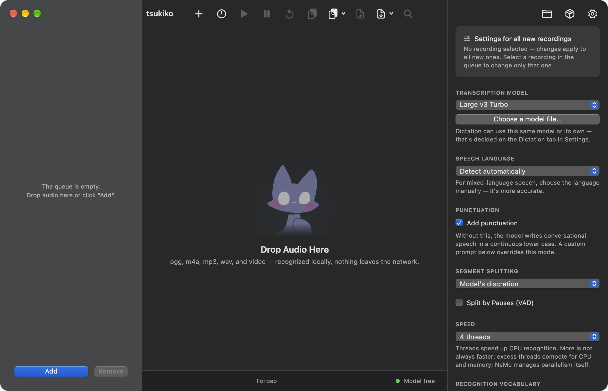
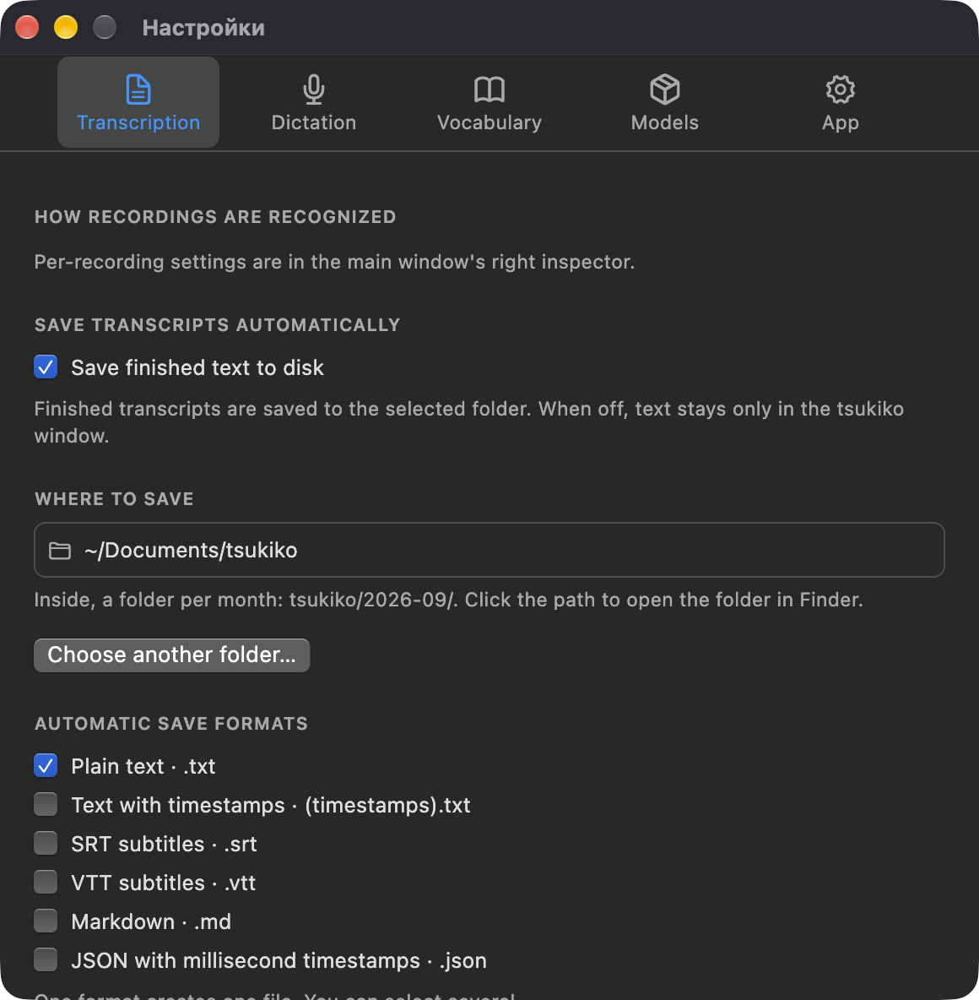

<div align="center">


# Tsukiko

**Private, local audio transcription, smart dictation, and voice activation for macOS and Windows.**  
*Not a single byte of audio or text leaves your machine. 100% offline, zero network latency, and absolute privacy.*

<p align="center">
  <b>English</b> •
  <a href="README.ru.md">Русский</a>
</p>

<p align="center">
  <a href="https://github.com/Yukovsky/tsukiko/releases"></a>
  
  <a href="LICENSE"></a>
  
  
  
</p>

<br />



</div>

---

## Table of Contents

- [Why Tsukiko](#why-tsukiko)
- [Key Features](#key-features)
- [Application Interface](#application-interface)
- [System Architecture](#system-architecture)
- [Tech Stack & Dependencies](#tech-stack--dependencies)
- [Installation & Quick Start](#installation--quick-start)
  - [Pre-built Releases](#pre-built-releases)
  - [First Launch on macOS](#first-launch-on-macos)
  - [Launch on Windows](#launch-on-windows)
- [User Guide & Workflows](#user-guide--workflows)
  - [1. Batch Audio & Video Transcription](#1-batch-audio--video-transcription)
  - [2. System-wide Global Dictation](#2-system-wide-global-dictation)
  - [3. Hands-Free Voice Activation](#3-hands-free-voice-activation)
  - [4. Custom Vocabulary & Prompt Hinting](#4-custom-vocabulary--prompt-hinting)
- [CLI Utility & Local API](#cli-utility--local-api)
  - [Command-line Tool](#command-line-tool)
  - [Local Secured REST API](#local-secured-rest-api)
- [AI Coding Agent Integration](#ai-coding-agent-integration)
- [Building from Source](#building-from-source)
- [Testing & Quality Assurance](#testing--quality-assurance)
- [Documentation Index](#documentation-index)
- [License](#license)

---

## Why Tsukiko

Most contemporary speech-to-text tools either send your private audio recordings to external cloud providers (compromising data confidentiality and incurring recurring subscription fees) or exist solely as raw terminal binaries lacking native desktop integration, floating HUDs, and personalized voice adaptation.

Tsukiko unites bare-metal C/C++ engine performance with an intuitive, native desktop experience:

| Feature | Tsukiko | Cloud ASR APIs *(Whisper API, AssemblyAI)* | Built-in OS Dictation *(Apple / Windows)* | Vanilla whisper.cpp CLI |
| :--- | :--- | :--- | :--- | :--- |
| **Data Privacy** | 🟢 **100% Local (Zero Telemetry)** | 🔴 Uploaded to remote servers | 🟡 Subject to OS telemetry | 🟢 100% Local |
| **Cost** | 🟢 **Free Forever (MIT)** | 🔴 Monthly subscription / per-minute fees | 🟢 Free (bundled with OS) | 🟢 Free (MIT) |
| **Offline Operation** | 🟢 **Complete (offline-first)** | 🔴 Requires active internet connection | 🟡 Limited offline models | 🟢 Complete |
| **Hardware Acceleration** | 🟢 **Metal (Apple Silicon) & Vulkan** | ⚪ Server-side GPU clusters | 🟢 Built-in NPU / SoC | 🟢 Metal, Vulkan, CUDA |
| **Batch File Queue** | 🟢 **Drag & Drop audio/video** | 🟡 Web dashboard uploads | 🔴 Not supported | 🟡 Shell scripts required |
| **Global System Dictation** | 🟢 **Hotkey + Native Floating HUD** | 🔴 Requires third-party plugins | 🟢 Basic text input | 🔴 Not supported |
| **Voice Activation** | 🟢 **Hands-Free (MFCC + DTW Calibration)** | 🔴 Not supported | 🟡 Standard OS phrase only | 🔴 Not supported |
| **Subtitle Export** | 🟢 **SRT, VTT, Markdown, JSON, TXT** | 🟡 Depends on API tier | 🔴 Plain text only | 🟢 SRT, VTT, TXT |
| **AI Agent Integration** | 🟢 **CLI, Local REST API, Built-in Skill** | 🟡 External cloud tokens | 🔴 Not supported | 🟡 Binary execution via bash |
| **Custom Vocabulary** | 🟢 **Prompt hints + Fuzzy replacer** | 🟡 Restricted prompt field | 🔴 Primitive OS dictionary | 🟡 Raw `--prompt` flag only |

---

## Key Features

### Complete Autonomy & Privacy
Every processing step—from microphone capture and wake-word keyword spotting to neural acoustic decoding and punctuation restoration—is computed entirely on your local machine. No telemetry, no cloud relays, and no third-party network requests.

### Native Whisper.cpp & Conformer GGUF Engines
Zero heavy external dependencies like Python, PyTorch, or separate CUDA runtimes:
- **Whisper.cpp** — Ultra-optimized C/C++ inference for OpenAI Whisper models. Supports models from the lightweight `tiny` up to `large-v3-turbo` with full hardware acceleration via **Apple Silicon Metal** on macOS and **Vulkan** on Windows.
- **NeMo-Speech.cpp** — High-speed inference for Conformer-based models (Nemotron, Parakeet) in GGUF format for real-time streaming audio transcription.

### System-Wide Dictation & Floating HUD
- Activate from any window using a customizable global shortcut (default: right `Command` on macOS or `F8` on Windows).
- Four recording indicators: full waveform panel, menu bar/system tray microphone, compact floating timer, or hidden. Switch instantly while recording.
- A full-size layout preview with separate controls for style, position and scale. Drag anywhere on the indicator; center snapping, Save, Cancel and Reset are available. Controls move to a free corner when the preview approaches.
- Record the next dictation while earlier recordings transcribe in FIFO order. The queue badge opens actions for the current transcription and waiting recordings.
- Automatic text synthesis and simulated keystroke insertion directly into your focused application (IDE, browser, terminal, notes, chat).

### Hands-Free Voice Activation
- True touchless dictation: trigger recording with a custom wake phrase (*e.g., "Jeff"*) and stop with a close phrase (*e.g., "Over and out"*).
- **Personalized Voice Calibration**: 13-band Mel-Frequency Cepstral Coefficients (MFCC) combined with Dynamic Time Warping (DTW), multi-template ensemble agreement, duration constraints, and adaptive ambient noise estimation.
- Impostor rejection: trains against similar-sounding phonemes to prevent false triggers from background conversations or television audio.

### Custom Vocabulary & Prompt Hinting
- Add technical terminology, framework names, acronyms, and proper nouns (*e.g., Kubernetes, PostgreSQL, Tsukiko*).
- Injects priority terms into Whisper's `initial_prompt` with automatic token window budget management.
- Post-processing fuzzy replacement engine catches homophones and specific acoustic misclassifications.

### Developer CLI, Local API & Agent Skill
- Standalone command-line tool **`tsukiko-transcribe`** for terminal power users and automated shell scripts.
- Secure local HTTP/WebSocket API server (`127.0.0.1:8756`) protected with bearer token authorization.
- Official built-in agent skill for autonomous coding assistants (**Claude Code**, **Antigravity**, **OpenAI Codex**, **OpenClaw**, **Hermes**).

### Desktop Interface & Mascot
- Beautiful Flutter desktop interface honoring Apple Human Interface Guidelines and modern Windows fluent designs.
- Native light and dark themes with fluid micro-animations.
- Interactive animated **Tsukiko (Moon Cat)** mascot (character design & artwork by [Feyza](https://feyzart.com/)) dynamically expressing app state (idle, listening, processing, success).

---

## Application Interface

<table align="center" width="100%">
  <tr>
    <td width="65%" align="center" valign="top">
      <b>Main Window: Batch Queue & Transcript Inspector</b><br /><br />
      
    </td>
    <td width="35%" align="center" valign="top">
      <b>Settings Window: Transcription & Voice Calibration</b><br /><br />
      
    </td>
  </tr>
</table>

---

## System Architecture

Transcription engines are compiled as native standalone binaries bundled inside the application package and orchestrated via isolated Inter-Process Communication (IPC), guaranteeing that heavy neural compute never blocks the 60fps Flutter UI:

```
                            ┌──────────────────────────────────────────────┐
                            │              Tsukiko Flutter UI              │
                            │   (Main Window, Queue, Settings, HUD)        │
                            └───────┬──────────────────────────────┬───────┘
                                    │                              │
                    MethodChannels / IPC                           │ Local HTTP / WS
                                    │                              │ (127.0.0.1:8756)
            ┌───────────────────────┴────────────────────┐         │
            ▼                                            ▼         ▼
    ┌───────────────────┐                        ┌───────────────────────┐
    │    whisper-cli    │                        │  tsukiko-transcribe   │
    │   (Batch Queue)   │                        │     (CLI Utility)     │
    ├───────────────────┤                        └───────────────────────┘
    │  whisper-server   │
    │(Streaming Dictate)│
    ├───────────────────┤
    │    nemo-speech    │
    │  (Conformer GGUF) │
    └───────────────────┘
```

> [!NOTE]
> For deep architectural explanations, audio pipelines, and memory lifecycles, refer to [docs/architecture.md](docs/architecture.md).

---

## Tech Stack & Dependencies

Tsukiko is built with high-performance native engines and modern desktop application frameworks:

| Category | Technologies & Libraries | Role |
| :--- | :--- | :--- |
| **Speech Inference** | `whisper.cpp`, `NeMo-Speech.cpp`, `sherpa-onnx` | C/C++ bare-metal inference without separate Python or PyTorch runtimes. |
| **Desktop UI Stack** | `Flutter Desktop`, `macos_ui`, `desktop_drop` | 60 fps cross-platform UI, native HIG aesthetics, and OS drag-and-drop handling. |
| **State Management** | `flutter_bloc`, `bloc_concurrency`, `equatable` | Robust event-driven state orchestration and concurrent queue processing. |
| **Hardware Compute** | Apple Silicon Metal, Vulkan SDK, ARM NEON, AVX2 | Direct GPU acceleration and optimized CPU SIMD vector processing. |
| **Audio & DSP** | `record`, CoreAudio, WASAPI, `libsamplerate`, FFmpeg | Low-latency mic capture, media container decoding, 16 kHz resampling, and custom MFCC acoustic DSP. |
| **OS Integration** | macOS Accessibility APIs, `CGEventTap`, Windows Hooks | System-wide global shortcut monitoring and simulated keystroke synthesis. |
| **Native Interop** | `dart:ffi`, `package:ffi` | Zero-overhead direct C/C++ library invocations. |

---

## Installation & Quick Start

### Pre-built Releases

Download pre-compiled binaries from the **[Releases](https://github.com/Yukovsky/tsukiko/releases)** page:

| Operating System | Package | Details |
| :--- | :--- | :--- |
| **macOS** | `tsukiko.dmg` | Universal DMG (Apple Silicon M1–M4 & Intel x86_64), signed with Apple Developer ID. |
| **Windows** | `tsukiko-setup.exe` | Native installer with automatic Vulkan GPU detection and CPU fallback. |

---

### First Launch on macOS

Tsukiko is signed with an Apple Developer certificate and distributed outside the Mac App Store:

1. Mount `tsukiko.dmg` and drag the **Tsukiko** icon into your **Applications (`/Applications`)** folder.
   > [!IMPORTANT]
   > Running directly from `Downloads` invokes macOS App Translocation, which resets granted permissions on application relaunch.
2. If macOS Gatekeeper presents a security prompt, navigate to **System Settings → Privacy & Security**, scroll down to "Security", and click **"Open Anyway"**.  
   *Or remove the quarantine flag via Terminal:*
   ```sh
   xattr -d com.apple.quarantine /Applications/Tsukiko.app
   ```
3. **Required Permissions**:
   - **Microphone**: Needed for voice recording during dictation and calibration.
   - **Accessibility**: Required to register the global shortcut and simulate keystrokes to insert transcribed text into active fields.

---

### Launch on Windows

1. Run `tsukiko-setup.exe` and follow the setup wizard prompts.
2. If an NVIDIA, AMD, or Intel GPU is present, Vulkan acceleration will automatically be engaged.
3. Grant microphone permissions when prompted by Windows 10/11.

---

## User Guide & Workflows

### 1. Batch Audio & Video Transcription
1. Drag and drop audio or video files into the application window.  
   *Supported formats*: `.wav`, `.mp3`, `.m4a`, `.ogg`, `.flac`, `.aac`, `.opus`, `.mp4`, `.mkv`, `.mov`, `.webm`, etc.
2. In the right-hand inspector panel, configure:
   - **Engine**: Whisper.cpp or NeMo Conformer.
   - **Model**: From lightweight `tiny` to state-of-the-art `large-v3-turbo`.
   - **Language**: Auto-detect or select a fixed language.
3. Click **"Start Transcription"**.
4. Review timestamped segments, navigate audio playback per segment, and export in **TXT**, **Markdown**, **SRT**, **VTT**, or **JSON** formats.

---

### 2. System-wide Global Dictation
1. Press the configured global hotkey (default: right `Command` on macOS or `F8` on Windows).
2. The floating HUD appears on your screen. Speak your thoughts naturally.
3. Release or press the hotkey again (or pause speaking if Voice Activity Detection is enabled).
4. Tsukiko transcribes your speech and pastes the text directly at your cursor location.


You can start the next recording while an earlier one is still being transcribed. Completed recordings wait in a FIFO queue; recognition and pasting run one at a time. The cancel hotkey cancels the microphone recording first, leaving earlier recordings untouched. The HUD counter includes the active transcription and waiting recordings. Its menu lets you record the next phrase, cancel the active transcription, or clear waiting recordings while preserving their audio for recovery. In clipboard-only mode, results from the same queue accumulate in order with line breaks.

Drag the HUD by its waveform (or the progress indicator during transcription) to move it; the position is saved when you release it. **Settings → Dictation → Adjust position and scale** opens a blue guide overlay with horizontal and vertical center snapping. Choose a scale from 80% to 160%, then **Save** or **Cancel**. Arrow keys move the island by one point; Shift+Arrow moves it by ten. Enter saves and Escape cancels. **Reset** restores the original bottom-center position and 100% scale. Saved coordinates adapt to the current monitor's work area and keep the island within screen bounds.

---

### 3. Hands-Free Voice Activation
1. Go to **Settings → Dictation → Voice Activation**.
2. Enable voice activation and set your trigger words (*e.g., "Jeff" to start, "Stop" to finish*).
3. Click **"Calibrate"** and complete the guided 4-step wizard:
   - Record 3 clear samples of your trigger phrase.
   - Record 1 similar impostor word (ensuring zero false alarms).
4. Dictate long emails, code comments, and messages completely hands-free.

---

### 4. Custom Vocabulary & Prompt Hinting
1. Open **Settings → Vocabulary**.
2. Add your project terms, acronyms, and names (*e.g., Kubernetes, PostgreSQL, Tsukiko*).
3. Define optional fuzzy replacement pairs for frequent homophone errors.
4. All entries will automatically bias the decoder model during subsequent transcriptions.

---

## CLI Utility & Local API

### Command-line Tool

Tsukiko bundles a standalone CLI utility for terminal workflows and automated batch scripting:

```sh
# On macOS:
/Applications/Tsukiko.app/Contents/Helpers/tsukiko-transcribe meeting.m4a --model medium --lang en

# On Windows:
"C:\Program Files\Tsukiko\helpers\tsukiko-transcribe.exe" meeting.m4a --model medium --lang en
```

> [!TIP]
> **Smart Routing**: When the Tsukiko desktop application is open, `tsukiko-transcribe` routes the job to the running app's worker queue via local IPC, eliminating redundant model loading. If the desktop app is closed, it executes autonomously and writes output to `stdout`.

---

### Local Secured REST API

Tsukiko serves a local HTTP/WebSocket API at `http://127.0.0.1:8756`:

```sh
# Example: Transcribe an audio file using curl:
curl -X POST http://127.0.0.1:8756/transcribe \
  -H "Authorization: Bearer <YOUR_LOCAL_API_KEY>" \
  -F "file=@voice_memo.m4a" \
  -F "language=en"
```

Your API key is generated locally and accessible under **Settings → Application → Local API**.

---

## AI Coding Agent Integration

Tsukiko lets coding assistants transcribe voice notes and instructions directly from terminal chats:

1. Open **Settings → Application → AI Agent Skill**.
2. Click **"Install Skill"** — Tsukiko auto-detects installed coding agents (Claude Code, Antigravity, OpenAI Codex, OpenClaw, Hermes) and copies the skill manifest.
3. Or manually link the skill definition located in [`skills/tsukiko/`](skills/tsukiko/README.md).

---

## Building from Source

### Prerequisites
- **Flutter SDK** (`>=3.12.2`)
- **CMake** (`>=3.20`)
- **Xcode & Command Line Tools** (for macOS builds)
- **Visual Studio 2022 C++ & Windows 10/11 SDK** (for Windows builds)
- **Python 3** (for packaging and validation tooling)

### macOS Build Instructions

```sh
# 1. Compile native C/C++ engines (whisper.cpp and nemo-speech):
./tool/engine.sh

# 2. Fetch Flutter packages:
flutter pub get

# 3. Build release desktop application:
flutter build macos --release

# 4. Package native helper tools and code-sign bundle:
./tool/sign.sh

# 5. Generate distributable DMG image:
./tool/dmg.sh
```

### Windows Build Instructions

```powershell
# In PowerShell (Run as Administrator):
.\tool\engine-win.ps1
flutter pub get
flutter build windows --release
.\tool\package-win.ps1
```

---

## Testing & Quality Assurance

Tsukiko maintains rigorous automated test coverage:

```sh
# Static code analysis:
flutter analyze

# Execute complete unit, integration, and widget test suite (544 tests):
flutter test

# Validate version consistency across all project manifests:
python3 tool/version.py check
```

---

## Documentation Index

Deep-dive technical documentation is available in the [`docs/`](docs/) directory:

- [System Architecture](docs/architecture.md) — Multi-engine Flutter desktop design, IPC protocols, audio pipelines, and memory lifecycles.
- [Building & Release Guide](docs/building-and-release.md) — Toolchain prerequisites, packaging, code signing, and CI/CD pipelines for macOS and Windows.

---

## License

Tsukiko is released under the **[MIT License](LICENSE)**.

### Third-Party Components
- **whisper.cpp** — MIT License (ggml-org/whisper.cpp)
- **NeMo-Speech.cpp** — Apache 2.0 License (NVIDIA Corporation)
- **sherpa-onnx** — Apache 2.0 License (k2-fsa/sherpa-onnx)

### Acknowledgements & Artwork
- **Tsukiko Mascot & Character Artwork** — Created by [Feyza (feyzart.com)](https://feyzart.com/). Special thanks to the artist for the wonderful character design and expressive animations that bring Tsukiko to life!

---

<div align="center">
  <sub>Built with a passion for privacy and precision engineering. Tsukiko © 2026.</sub>
</div>
